# AWS Networking Concepts + Terraform Infrastructure

## 🏙️ Think of AWS Networking Like a City Planning System

### 🌍 The Complete Picture: From City to House

**AWS = A Country | Your Account = A State | VPC = A City**

---

## 🏢 AWS Networking Concepts Explained (Never Forget Again!)

### 1. 🏙️ **VPC (Virtual Private Cloud)** = Your Entire City

```
Think: "I'm the mayor of my own private city in the AWS country"
```

- **What**: Your isolated network in AWS (like owning an entire city)
- **Why**: Complete control over your network environment
- **Size**: Can be huge (like Tokyo) or small (like a town)
- **Rule**: One VPC = One isolated network city

**Real Example**: `VPC: 10.0.0.0/16` = Your city can have 65,536 addresses (houses)

---

### 2. 🔢 **CIDR (Classless Inter-Domain Routing)** = City Address System

```
Think: "ZIP codes and house numbering system for my city"
```

- **What**: IP address ranges (like postal codes)
- **Format**: `10.0.0.0/16` means "10.0.X.X" where X can be 0-255
- **The /16 Rule**:
  - `/16` = 65,536 addresses (big city)
  - `/24` = 256 addresses (small neighborhood)
  - `/32` = 1 address (one specific house)

**Memory Trick**:

- Smaller number after `/` = BIGGER network
- `/8` = Megacity (16 million addresses)
- `/24` = Neighborhood (256 addresses)

---

### 3. 🚪 **Internet Gateway** = City's Main Gate to Outside World

```
Think: "The only official entrance/exit to my private city"
```

- **What**: Bridge between your VPC and the internet
- **Rule**: One VPC = One Internet Gateway (like one main city gate)
- **Job**: Controls ALL traffic in/out of your city
- **Without it**: Your city is completely isolated (no internet)

---

### 4. 🏘️ **Subnets** = Neighborhoods in Your City

```
Think: "Different neighborhoods for different types of residents"
```

- **Public Subnet** = Beachfront neighborhood (everyone can see/access)
  - Has route to Internet Gateway
  - Resources get public IPs
  - Example: Web servers, load balancers

- **Private Subnet** = Gated community (residents only)
  - No direct internet access
  - More secure
  - Example: Databases, internal services

**Memory Rule**:

- Public subnet = "Can be Googled and found"
- Private subnet = "Unlisted phone number"

---

### 5. 🛡️ **Security Groups** = Personal Bodyguards for Each House

```
Think: "Each house has its own bouncer checking IDs"
```

- **What**: Firewall rules for individual resources (EC2, RDS, etc.)
- **How**: Allow/deny specific ports and protocols
- **Scope**: Follows the resource wherever it goes
- **Default**: Deny all inbound, allow all outbound

**Example Rules**:

```
- Allow Port 22 (SSH) from your IP only = "Only I can enter through the back door"
- Allow Port 80 (HTTP) from anywhere = "Front door open to public"
- Allow Port 3306 (MySQL) from web servers only = "Database only talks to web servers"
```

---

### 6. 🗺️ **Route Tables** = GPS Navigation System for Your City

```
Think: "Traffic directions: where should cars go?"
```

- **What**: Rules that decide where network traffic goes
- **Job**: "If someone wants to reach 0.0.0.0/0 (internet), send them to Internet Gateway"
- **Types**:
  - **Public Route Table**: Has route to Internet Gateway
  - **Private Route Table**: No internet route (or through NAT)

**Example Route Table**:

```
Destination: 10.0.0.0/16 → Target: Local (stay in city)
Destination: 0.0.0.0/0 → Target: Internet Gateway (go to internet)
```

---

## 🏗️ The Complete Architecture Story

```
🌍 INTERNET
    ↓
🚪 Internet Gateway (City Main Gate)
    ↓
🏙️ VPC: 10.0.0.0/16 (Your Private City - 65k addresses)
    ↓
┌─────────────────────────────────────────────────┐
│  🗺️ Route Table: "Where should traffic go?"      │
├─────────────────────────────────────────────────┤
│  Public Subnet: 10.0.1.0/24 (256 addresses)    │
│  🏘️ "Beachfront Neighborhood"                   │
│  ├─ 🖥️ Web Server (Public IP)                   │
│  │  └─ 🛡️ Security Group: Allow 80,443 from *  │
│  └─ 🔧 Bastion Host (SSH Gateway)               │
│     └─ 🛡️ Security Group: Allow 22 from MY_IP  │
├─────────────────────────────────────────────────┤
│  Private Subnet: 10.0.2.0/24 (256 addresses)   │
│  🏘️ "Gated Community"                           │
│  ├─ 🗄️ Database Server (No Public IP)           │
│  │  └─ 🛡️ Security Group: Allow 3306 from Web   │
│  └─ 🔐 Internal API (No Public IP)              │
│     └─ 🛡️ Security Group: Allow 8080 from Web   │
└─────────────────────────────────────────────────┘
```

---

## 🧠 Memory Anchors (Never Forget These!)

### 1. **The City Analogy**

- VPC = Your private city
- Subnets = Neighborhoods  
- Internet Gateway = Main city gate
- Security Groups = Personal bodyguards
- Route Tables = GPS navigation
- CIDR = Address/ZIP code system

### 2. **The /Number Rule**

- `/16` = Big city (65k addresses)
- `/24` = Neighborhood (256 addresses)  
- `/32` = One house (1 address)
- **Smaller / number = BIGGER network**

### 3. **Public vs Private**

- Public = "Has a Google Maps listing"
- Private = "Unlisted, invite-only"

### 4. **Security Groups vs NACLs**

- Security Groups = Personal bodyguard (follows you)
- NACLs = Neighborhood checkpoint (stationary)

---

## Day 4 - DigitalOcean + Cloudflare Setup

```mermaid
graph TB
    %% External Services
    Internet[🌍 Internet]
    TerraformCloud[☁️ Terraform Cloud<br/>State Management & Locking]
    GitHub[📦 GitHub Repository<br/>Infrastructure Code]
    
    %% Cloud Providers
    subgraph DO[DigitalOcean]
        DODroplet[🖥️ Ubuntu Droplet<br/>shaku-ka-droplet<br/>s-1vcpu-1gb<br/>blr1 region]
        DOSpaces[📦 DO Spaces<br/>Object Storage<br/>Optional Backend]
    end
    
    subgraph CF[Cloudflare]
        CFR2[🗄️ Cloudflare R2<br/>my-infra bucket<br/>Terraform State Storage]
        CFCDN[⚡ CDN Services<br/>DNS Management]
    end
    
    %% Terraform Components
    subgraph Local[Local Development]
        TFCode[📄 Terraform Files<br/>main.tf<br/>backend.tf<br/>variables.tf]
        TFState[💾 terraform.tfstate<br/>Infrastructure State]
    end
    
    %% Connections
    Internet --> DODroplet
    Internet --> CFCDN
    
    TerraformCloud --> TFCode
    GitHub --> TFCode
    
    TFCode --> DODroplet
    TFCode --> CFR2
    TFCode --> CFCDN
    
    CFR2 --> TFState
    TerraformCloud -.-> TFState
    
    %% Styling
    classDef cloud fill:#e1f5fe
    classDef storage fill:#f3e5f5
    classDef compute fill:#e8f5e8
    classDef terraform fill:#fff3e0
    
    class TerraformCloud,GitHub cloud
    class CFR2,DOSpaces,TFState storage
    class DODroplet compute
    class TFCode,Local terraform
```



## Architecture Overview

### Components

1. **Compute Resources**:
   - DigitalOcean Droplet (`shaku-ka-droplet`)
   - Ubuntu 22.04 LTS
   - 1 vCPU, 1GB RAM
   - Bangalore region (blr1)

2. **State Management**:
   - **Current**: Cloudflare R2 bucket for remote state
   - **Recommended**: Terraform Cloud for state + locking
   - Local state files (development only)

3. **Infrastructure as Code**:
   - Terraform configuration files
   - Version controlled in GitHub
   - Variables managed securely

4. **Security**:
   - API tokens stored as sensitive variables
   - State locking prevents concurrent modifications
   - Remote state encryption

### State Backend Options

#### Option 1: Cloudflare R2 (Current)

```hcl
terraform {
  backend "s3" {
    bucket   = "my-infra"
    key      = "terraform.tfstate"
    region   = "auto"
    endpoint = "https://xxx.r2.cloudflarestorage.com"
    # No native locking - manual coordination required
  }
}
```

#### Option 2: Terraform Cloud (Recommended)

```hcl
terraform {
  backend "remote" {
    organization = "your-org"
    workspaces {
      name = "day-4"
    }
    # Built-in state locking and collaboration features
  }
}
```

### Workflow

1. **Development**: Write Terraform code locally
2. **Version Control**: Commit to GitHub repository
3. **State Management**: Store state remotely for team collaboration
4. **Deployment**: Apply changes to DigitalOcean infrastructure
5. **Monitoring**: Track changes and state through Terraform Cloud

---

*Generated from Day-4 Terraform configuration*
