# Terraform Infrastructure Diagram

## Day 4 - DigitalOcean + Cloudflare Setup

```mermaid
graph TB
    %% External Services
    Internet[🌍 Internet]
    TerraformCloud[☁️ Terraform Cloud<br/>State Management & Locking]
    GitHub[📦 GitHub Repository<br/>Infrastructure Code]
    
    %% Cloud Providers
    subgraph DO[DigitalOcean]
        DODroplet[🖥️ Ubuntu Droplet<br/>shaku-ka-droplet<br/>s-1vcpu-1gb<br/>blr1 region]
        DOSpaces[📦 DO Spaces<br/>Object Storage<br/>Optional Backend]
    end
    
    subgraph CF[Cloudflare]
        CFR2[🗄️ Cloudflare R2<br/>my-infra bucket<br/>Terraform State Storage]
        CFCDN[⚡ CDN Services<br/>DNS Management]
    end
    
    %% Terraform Components
    subgraph Local[Local Development]
        TFCode[📄 Terraform Files<br/>main.tf<br/>backend.tf<br/>variables.tf]
        TFState[💾 terraform.tfstate<br/>Infrastructure State]
    end
    
    %% Connections
    Internet --> DODroplet
    Internet --> CFCDN
    
    TerraformCloud --> TFCode
    GitHub --> TFCode
    
    TFCode --> DODroplet
    TFCode --> CFR2
    TFCode --> CFCDN
    
    CFR2 --> TFState
    TerraformCloud -.-> TFState
    
    %% Styling
    classDef cloud fill:#e1f5fe
    classDef storage fill:#f3e5f5
    classDef compute fill:#e8f5e8
    classDef terraform fill:#fff3e0
    
    class TerraformCloud,GitHub cloud
    class CFR2,DOSpaces,TFState storage
    class DODroplet compute
    class TFCode,Local terraform
```



## Architecture Overview

### Components

1. **Compute Resources**:
   - DigitalOcean Droplet (`shaku-ka-droplet`)
   - Ubuntu 22.04 LTS
   - 1 vCPU, 1GB RAM
   - Bangalore region (blr1)

2. **State Management**:
   - **Current**: Cloudflare R2 bucket for remote state
   - **Recommended**: Terraform Cloud for state + locking
   - Local state files (development only)

3. **Infrastructure as Code**:
   - Terraform configuration files
   - Version controlled in GitHub
   - Variables managed securely

4. **Security**:
   - API tokens stored as sensitive variables
   - State locking prevents concurrent modifications
   - Remote state encryption

### State Backend Options

#### Option 1: Cloudflare R2 (Current)

```hcl
terraform {
  backend "s3" {
    bucket   = "my-infra"
    key      = "terraform.tfstate"
    region   = "auto"
    endpoint = "https://xxx.r2.cloudflarestorage.com"
    # No native locking - manual coordination required
  }
}
```

#### Option 2: Terraform Cloud (Recommended)

```hcl
terraform {
  backend "remote" {
    organization = "your-org"
    workspaces {
      name = "day-4"
    }
    # Built-in state locking and collaboration features
  }
}
```

### Workflow

1. **Development**: Write Terraform code locally
2. **Version Control**: Commit to GitHub repository
3. **State Management**: Store state remotely for team collaboration
4. **Deployment**: Apply changes to DigitalOcean infrastructure
5. **Monitoring**: Track changes and state through Terraform Cloud

---

*Generated from Day-4 Terraform configuration*
